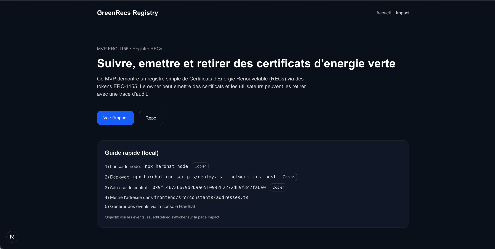
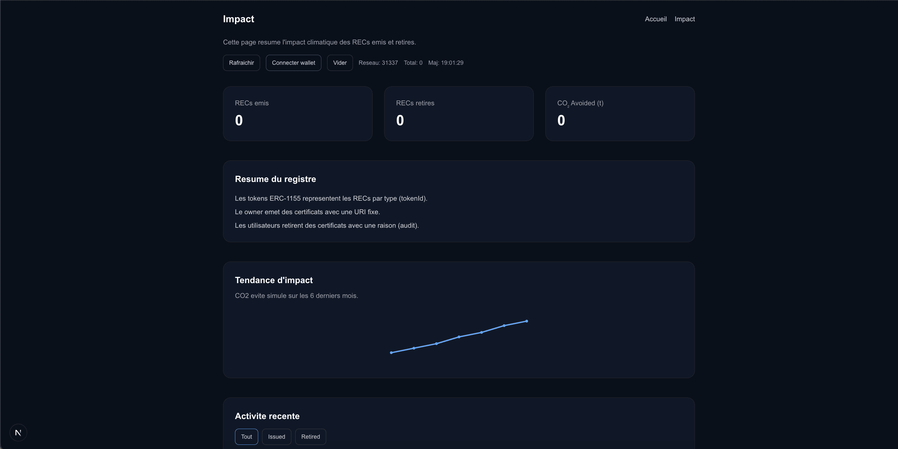

# GreenRecs Registry (MVP)

## Presentation
MVP ERC-1155 pour un registre de certificats d'energie renouvelable (RECs).
Objectif: emettre, retirer, et visualiser l'impact via une page "Impact".

## Structure
- `backend/` : smart contract + tests + scripts
- `frontend/` : Next.js (pages Home + Impact)

## Lancer en local (pas a pas)
## Lancer en local (pas a pas)

### 1) Backend : node + deploy
```bash
cd "backend"
npx hardhat node
```

Dans un autre terminal:
```bash
cd "backend"
npx hardhat run scripts/deploy.ts --network localhost
```

Copier l'adresse affichee et la mettre ici:
`frontend/src/constants/addresses.ts`

### 2) Frontend
```bash
cd "frontend"
npm install
NEXT_DISABLE_TURBOPACK=1 npm run dev
```

Ouvrir `http://localhost:3001` (ou le port affiche).

## Generer des events (Impact)
```bash
cd "backend"
npx hardhat console --network localhost
```

```js
const { ethers } = await network.connect();
const registry = await ethers.getContractAt("GreenRecsRegistry","0xVOTRE_ADRESSE");
const [owner, user] = await ethers.getSigners();

await registry.issue(user.address, 1n, 500n, "ipfs://rec-001.json");
await registry.issue(user.address, 2n, 300n, "ipfs://rec-002.json");
await registry.connect(user).retire(1n, 120n, "offset");
```

Recharge `/impact` et clique **Rafraichir**.

## Tests (backend)
```bash
cd "backend"
npx hardhat test
```

## Screenshots
Ajoute tes captures ici :
- `docs/screenshots/`

| Ecran | Apercu |
| --- | --- |
| Accueil |  |
| Impact |  |

## Deploiement (Vercel)
Le frontend utilise une adresse de contrat locale. Pour une demo publique,
il faut deployer le contrat sur un reseau public (ex: Sepolia) et remplacer
`frontend/src/constants/addresses.ts`.

Sur Vercel, selectionne le dossier `frontend` (framework Next.js) et deploie.
